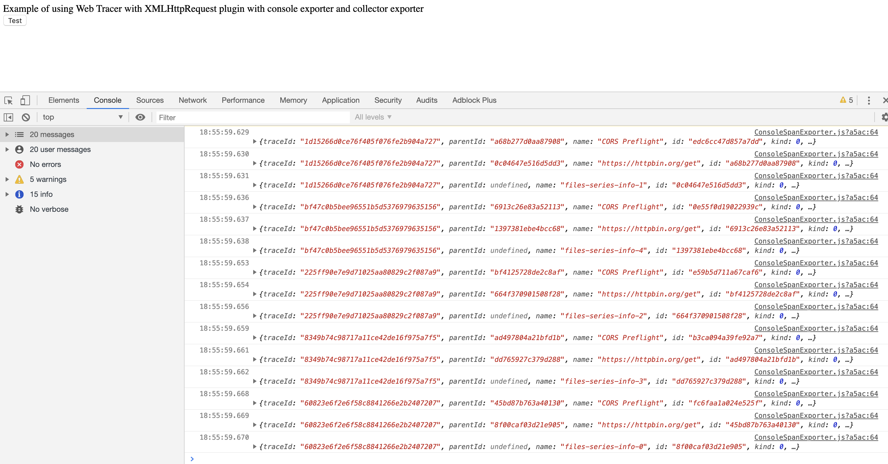

npm # Overview

This example shows how to use [@opentelemetry/web](https://github.com/open-telemetry/opentelemetry-js/tree/master/packages/opentelemetry-web) with different plugins and setup to instrument your JavaScript code running in the browser.

## Installation

```sh
$ # from this directory
$ npm install
```

## Run the Application

```sh
$ # from this directory
$ npm start
```

By default, the application will run on port `8090`.

## Examples

### Document Load

To see the results, open the browser at <http://localhost:8090/document-load/> and make sure you have the browser console open. The application is using the `ConsoleSpanExporter` and will post the created spans to the browser console.

The screen will look as follows:


### XMLHttpRequest

To see the results, open the browser at <http://localhost:8090/xml-http-request/> and make sure you have the browser console open. The application is using the `ConsoleSpanExporter` and will post the created spans to the browser console.
The screen will look as follows:




## Useful links

- For more information on OpenTelemetry, visit: <https://opentelemetry.io/>
- For more information on web tracing, visit: <https://github.com/open-telemetry/opentelemetry-js/tree/master/packages/opentelemetry-web>

## LICENSE

Apache License 2.0
